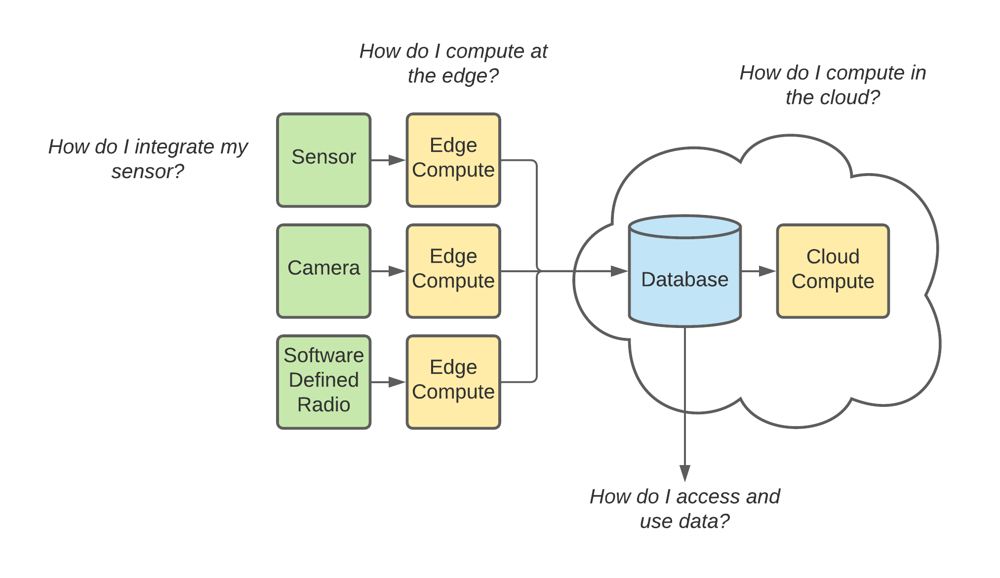

# Waggle: A distributed software-defined sensor network.

## What is Sage?

Geographically distributed sensor systems that include cameras, microphones, and weather and air quality stations can generate such large volumes of data that fast and efficient analysis is best performed by an embedded computer connected directly to the sensor. Sage is exploring new techniques for applying machine learning algorithms to data from such intelligent sensors and then building reusable software that can run programs within the embedded computer and transmit the results over the network to central computer servers. Distributed, intelligent sensor networks that can collect and analyze data are an essential tool for scientists seeking to understand the impacts of global urbanization, natural disasters such as flooding and wildfires, and climate change on natural ecosystems and city infrastructure.

Sage & Waggle is deploying sensor nodes that support machine learning frameworks in environmental testbeds in California, Colorado, and Kansas and in urban environments in Illinois and Texas. The reusable cyberinfrastructure running on these testbeds will give climate, traffic, and ecosystem scientists new data for building models to study these coupled systems. The software components developed are open source and provide an open architecture to enable scientists from a wide range of fields to build their own intelligent sensor networks.

Partners are deploying testbeds in Australia, Japan, UK, and Taiwan, providing scientists with even more data for analysis. The toolkit is also extending the current educational curriculum used in Chicago to inspire young people – with an emphasis on women and minorities, to pursue science, technology, and mathematics careers – by providing a platform for students to explore measurement-based science questions related to the natural and built environments.

The data from sensors and applications is hosted in the cloud to facilitate easy data analysis.

## Who are the users of Sage & Waggle?

The most common users have included:

- Domain scientists interested in developing edge AI applications.
- Users interested in sensor and application-produced datasets.
- Cyberinfrastructure researchers interested in platform research.
- Domain scientists interested in adding new sensors and deploying nodes to answer specific science questions.

## How do I use the platform?

This depends on your desired interaction interest.  The platform consists of edge compute applications which process data (ex. sensor readings, camera images, audio recordings, etc). These edge applications then produce their own data (ex. inferences) and upload the results to a cloud database. This cloud database can be accessed directly and/or additional compute can be performed on the cloud data.

The entry-point into learning about your interaction with the system might be best directed by getting answers (by following the links) to the question(s) you are most interested in.

[How do I access sensors?](../tutorials/access-waggle-sensors.md)
- Want to learn about existing, supported sensors?
- Do you have a new sensor that you want to write an edge application for?

[How do I run edge apps?](../tutorials/edge-apps/intro-to-edge-apps)
- Want to know how to create an edge app?
- Want to know how your edge app can get access to edge sensor data?
- Want to share your edge app data with other edge applications?
- Want to know how to upload data to the cloud?

[How do I access and use data?](../tutorials/accessing-data.md)
- Want to learn about how data is stored/organized?
- Do you have data that is up in the cloud and want to know how to access it?

[How do I compute in the cloud?](../tutorials/cloud-compute.md)
- Want to know how to autonomously react to edge produced data?
- Want to know how to trigger an HPC event?
- Want to get a text message when your edge application does something cool?

[How do I build my own device?](../tutorials/create-waggle.md)
- Want to set up your own device for local edge app development?
- Want to teach AI to a classroom of students?

## How is the cyberinfrastructure architected?

If you are interested in learning more about how the cyberinfrastructure works you can head on over to the [Architecture Overview](./architecture.md) page.
