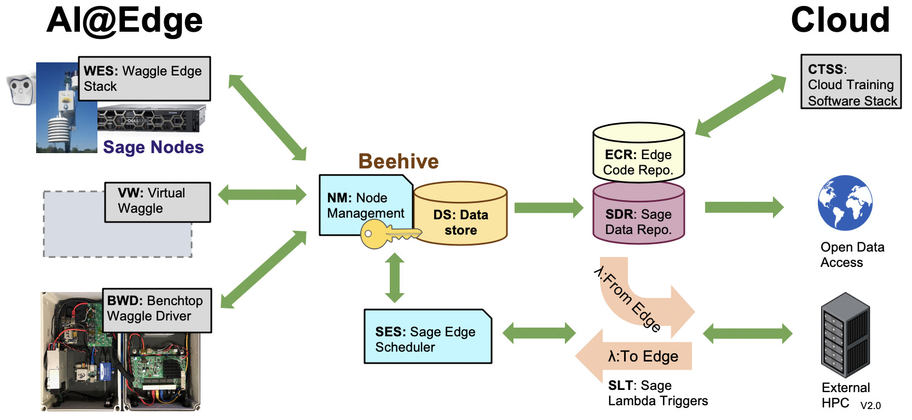

# Sage: A distributed software-defined sensor network.

## Overview
The [Sage project](https://sagecontinuum.org/) will design and build a new kind of national-scale reusable cyberinfrastructure to enable AI at the edge.

Geographically distributed sensor systems that include cameras, microphones, and weather and air quality stations can generate such large volumes of data that fast and efficient analysis is best performed by an embedded computer connected directly to the sensor. Sage will explore new techniques for applying machine learning algorithms to data from such intelligent sensors and then build reusable software that can run programs within the embedded computer and transmit the results over the network to central computer servers. Distributed, intelligent sensor networks that can collect and analyze data are essential for scientists seeking to understand the impacts of global urbanization, natural disasters such as flooding and wildfires, and climate change on natural ecosystems and city infrastructure.

Sage will deploy sensor nodes that support machine learning frameworks in environmental testbeds in California, Colorado, and Kansas and in urban environments in Illinois and Texas. The reusable cyberinfrastructure running on these testbeds will give climate, traffic, and ecosystem scientists new data for building models to study these coupled systems. The software components developed in Sage will be open source and provide an open architecture that will enable scientists from a wide range of fields to build their own intelligent sensor networks.

Partners will deploy Sage testbeds in Australia, Japan, UK, and Taiwan, providing scientists with even more data for analysis. The toolkit will also extend the current educational curriculum used in Chicago and will inspire young people – with an emphasis on women and minorities, to pursue science, technology, and mathematics careers – by providing a platform for students to explore measurement-based science questions related to the natural and built environments.

Sage will develop open source computer code and provide open hardware design documents.  The data from sensors will also be hosted in the cloud to facilitate easy data analysis.

The Sage project draws a lot of software and hardware from the [Waggle AI@Edge](https://github.com/waggle-sensor/waggle) platform.

### [Sage Architecture Overview](./arch-overview)

### [User Interaction with Sage](./user-interaction.md)

