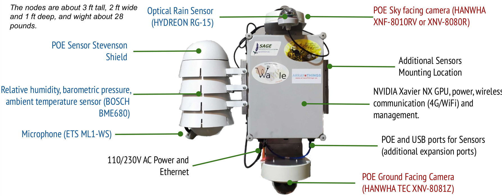

# Integrate my sensors into SAGE

A SAGE sensor is an entity that produces measurements of a phenomenon and that helps users analyze what is happening in the environment. There are sensors already hosted by SAGE and also sensors that are being integrated into SAGE as a user sensor. A sensor does not necessarily mean a physical device, but can be a program producing measurements from data -- we call it `software-defined sensor`. Once those sensors are available in SAGE nodes user applications can pull measurements from the sensors to process them.

In general, SAGE sensors are desinged to be accessible from any user applications running on the SAGE node that hosts the sensors, but can be limited its access to groups and personnel. Ideally, those SAGE sensors form and support SAGE ecosystem where sensor measurements are integrated and used for higher level computation and complex decision making.

## SAGE Physical sensors

The SAGE node is designed to accommodate sensors commonly used to support environmental science, but not limited to host other sensors. The currently supported sensors are,

_NOTE: not all SAGE nodes have the same set of sensors, and the sensor configuration depends on what to capture from the environment once the node is deployed_
- [BME680](https://sage-commons.sdsc.edu/dataset/bme680): temperature, humidity, pressure, and gas
- [RG-15](https://sage-commons.sdsc.edu/dataset/rg-15): rainfall
- [ETS ML1-WS](https://www.a1securitycameras.com/ets-ml1-ws.html): 20-16 kHz microphone recording sound
- [XNV-8080R](https://sage-commons.sdsc.edu/dataset/xnv-8080r): 5 MP camera with 92.1 degree horizontal and 67.2 degree vertical angle view
- [XNV-8082R](https://sage-commons.sdsc.edu/dataset/xnv-8082r):  6 MP camera with 114 degree horizontal and 62 degree vertical angle view
- [XNF-8010RV](https://sage-commons.sdsc.edu/dataset/xnf-8010rv): 6 MP fisheye camera with 192 degree horizontal and vertical angle view
- [XNV-8081Z](https://sage-commons.sdsc.edu/dataset/xnv-8081z): 5 MP digital pan-tilt-rotate-zoom camera

Any collaborators and user communities can bring up their own sensors to SAGE node. The node can host sensor devices that support serial interface as well as network interface (e.g., http, rtsp, etc). The currently supported user sensors are,

_NOTE: those sensors may not be available on all SAGE nodes as it depends on what SAGE nodes need to host them_
- Software-defined Radio: detecting raindrops and snow flakes
- Radiation detector: radiation detector
- LIDAR: distance of nearby objects
- Mobotics: infrared camera

_TODO: add links for the user sensors and also link where users find detailed resource to add their sensor to SAGE_

## SAGE software-defined sensors
Software-defined sensors are limitless as user applications define it. You can start building your application that publishes outputs using [PyWaggle's basic example](https://github.com/waggle-sensor/pywaggle/blob/main/docs/writing-a-plugin.md#basic-example) that can become a software-defined sensor. Later, such outputs can be consumed by other user applications to produce higher level information about the measurements. A few example of SAGE software-defined sensors are,

- [Object Counter](https://github.com/waggle-sensor/plugin-objectcounter): `env.count.OBJECT` counts objects from an image, where `OBJECT` is the object name that is recognized

## Access to SAGE sensors
To be added