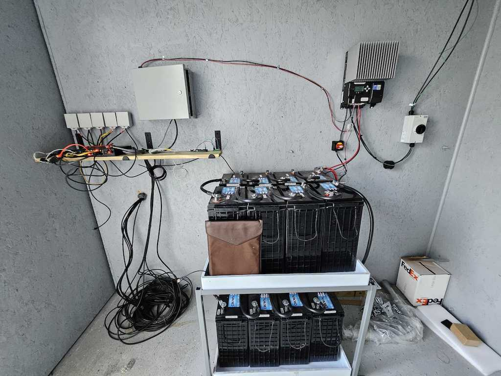

## Sage Collaborates with The Nature Conservancy

<!-- Todo: write a more detailed intro about the partnership.  Then, share this recent story. -->
In collaboration with [The Nature Conservancy](https://www.nature.org/), two Sage nodes were deployed at the [Emiquon Preserve](https://www.nature.org/en-us/get-involved/how-to-help/places-we-protect/emiquon/) to monitor wildlife and understand conditions of the local environment. The Sage nodes [W020](https://portal.sagecontinuum.org/node/W020) and [W01B](https://portal.sagecontinuum.org/node/W01B) are equipped with both stationary and pan-tilt-zoom-able cameras and meteorological sensors including dust and weather sensors. The Sage node [W01B](https://portal.sagecontinuum.org/node/W01B) is the first field-deployed node powered by renewable energy from eight solar panels.

<!-- truncate -->

A butterfly came and landed on the tower during Sage node and sensor installation

A Sage node, equipped with cameras, microphone, and meteorological sensors, was strapped on a 15 m tall tower. 2 pan-tilt-zoom cameras providing visible and infrared images will be looking at wildlife and the preserve to monitor the environment. The sky-facing fisheye camera provides complete sky view that will allow to analyze clouds and local weather condition. The dust sensor will measure quality of the atmosphere. The full list of sensors can be found [here](https://portal.sagecontinuum.org/node/W01B?tab=sensors).

The W01B Sage node is completely powered by renewable energe storage with 8 of 1 m x 2 m solar panels. This system not only provides power to the node, but also allows to analyze the local solar power production based on weather and cloud coverage, that can be obtained from the Sage node's sensors.