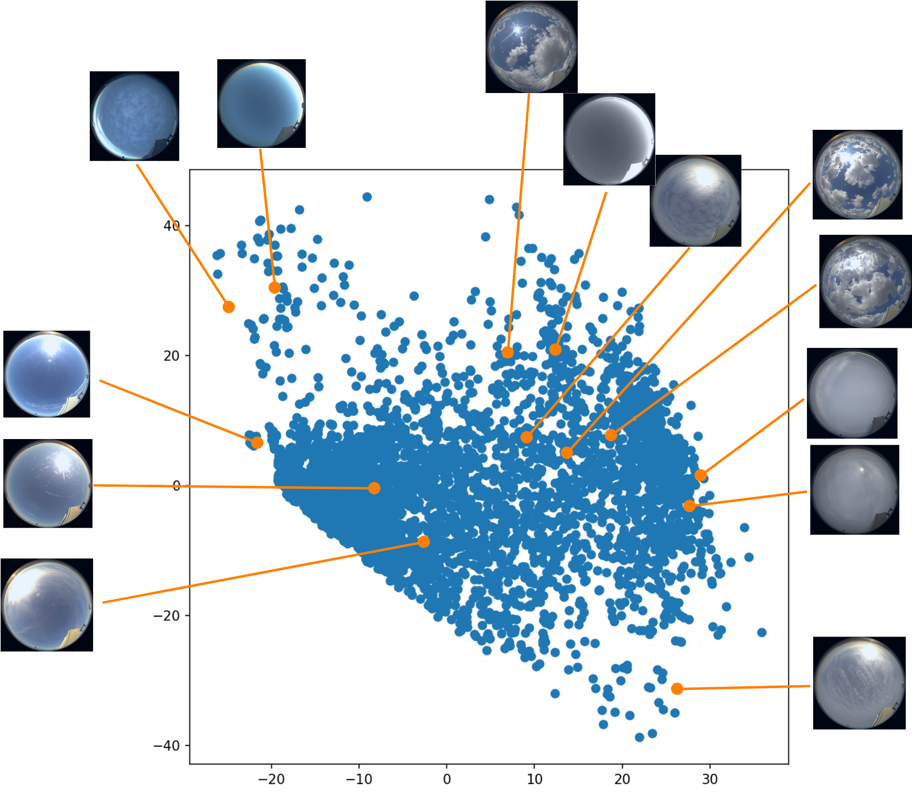
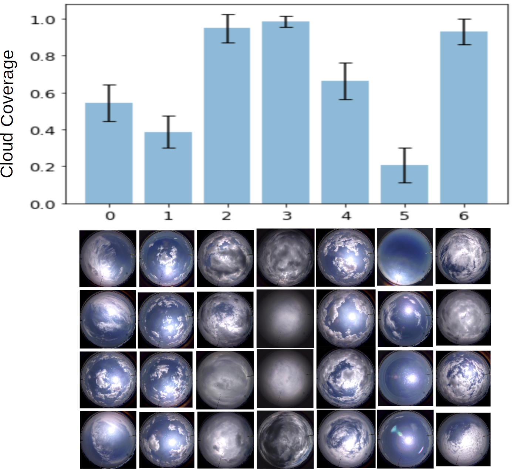

# Unleashing the Power of Collaboration

Clouds have long fascinated humans because of their complex and diverse nature. To gain a deeper understanding of these atmospheric phenomena, a multidisciplinary team of computer scientists, meteorologists, and machine learning experts from Northwestern-Argonne Institute of Science and Engineering (NAISE) collaborated on the National Science Foundation (NSF)-supported SAGE project. The project's goal was to develop new edge computing technologies that would allow scientists to collect and analyze large amounts of data from advanced sensors in real time.

Inspired by compelling results after applying a self-supervised machine learning model (called DINO) to bird sound analysis, our team explored the possibility of utilizing similar techniques to study cloud images (referring to it as ClouDINO). Encouraging early results prompted us to seek further application of the model by leveraging data from the Atmospheric Radiation Measurement (ARM) User Facility at the Department of Energy's Southern Great Plains (SGP) atmospheric observatory and Argonne Testbed for Multiscale Observational Science (ATMOS) at the U.S. Department of Energy’s Argonne National Laboratory.

**Fig:1** _The feature vectors trained with DINO in PCS space._

We used a self-supervised learning model capable of autonomously extracting prominent features from ground-based sky camera images. Using a joint embedding architecture with Vision Transformers, our model learned to autonomously segment cloudy images and classify them based on their properties such as coverage, diurnal variation, and cloud base height. Notably, the self-supervised model even showed potential for semantic segmentation without the need for labeled data which we would like to explore further. The results were comparable to the other studies of our team lead by Bobby Jackson, an atmospheric scientist and instrument specialist at Argonne, who primarily utilized Doppler Lidar data. Furthermore, Seongha Park's prior work in solar energy prediction, leveraging her expertise in computer science and information technology, significantly complemented our findings and greatly boosted our validation efforts with new a dataset. This made our results more robust due to intercomparison from the different perspectives.

**Fig:2** _K-means clusters of the above feature vectors._

One particular impact of our work will be on the incorporation of edge computing via SAGE nodes, enabling self-supervised learning to occur at the edge itself. This real-time data processing will remove the need of transmitting large data to the cloud, and it can enable sensor configuration in response to changing conditions and opening new avenues for application, putting privacy at the peak priority. We are testing our ideas at the edge thanks to the constant support provided by the Waggle cyber infrastructure team.

**Fig:3** _Sage node at the ARM User Facility at Southern Great Plains (SGP) atmospheric observatory._

As we published our findings, we reflected on the knowledge and experience acquired during this period. Dario Dematties, a machine learning expert, expanded his understanding of clouds, while Bhupendra Raut, a meteorologist, delved deeper into the intricacies of advanced machine learning models. The journey not only was intellectually stimulating but also filled with joy and team spirit. This work is an example of the power of blending expertise from various fields to gain deeper insights into the natural world.

Looking ahead, we plan to utilize more SAGE data with advanced machine learning techniques. By harnessing multiple sources of  diverse data from the NSF NEON, the DOE ARM and CROCUS projects we can adapt our model's architecture to capture the complexities of weather and climate processes. Our collaborative project exemplifies the power of multidisciplinary teamwork and the potential of edge computing in advancing earth science.

## Featured works
[1] Dematties et al. (2023) - Self-Supervised Approach for Cloud Image Analysis in Artificial Intelligence for the Earth Systems, 2(2), p.220063.

[2] Jackson et al. (2023) - ARMing the Edge: Designing Edge Computing-Capable Machine Learning Algorithms for ARM Doppler Lidar Processing in Artificial Intelligence for Earth Systems, doi.org/10.1175/AIES-D-22-0062.1.

[3] Raut et al. (2023) - Self-Supervised Approach for Cloud Image Analysis in the 103rd AMS Annual Meeting.

[4] Dematties et al. (2022) - Self-Supervised Learning for Automated Species Detection from Soundscapes in Avian Diversity Monitoring at SC22 Conference, Dallas, Texas.

