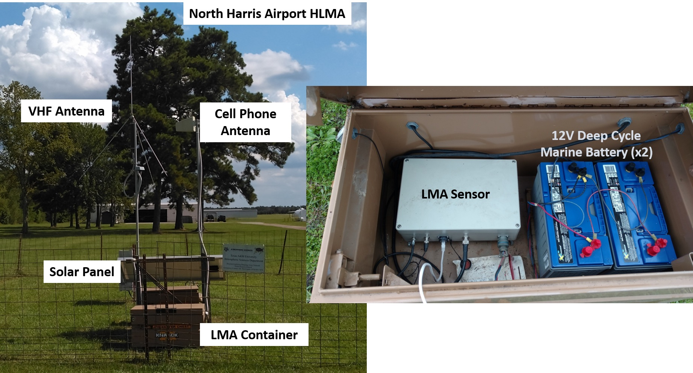
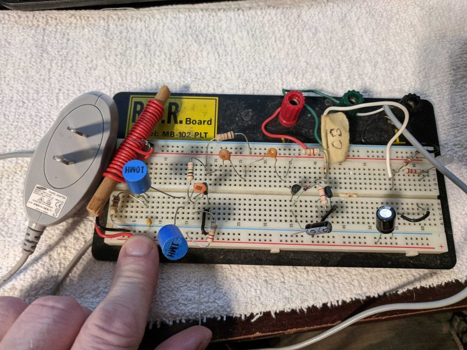
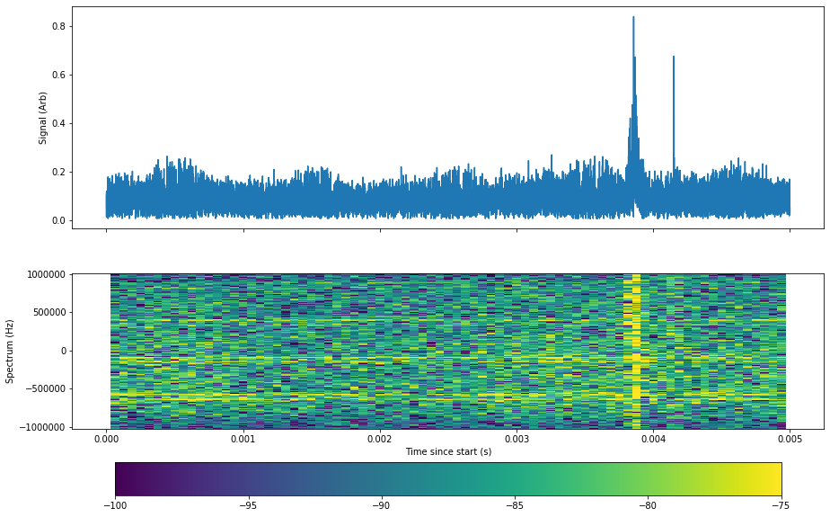

# Lightning Science

## Overview

Atmospheric driven electrical discharges (lightning) occur when vigorous vertical motions in thunderstorms (updrafts) produce larger ice particles (graupel) which, through the thermoelectric effect, can promote the charging of cloud systems. When the electric field is so large that electrons can be liberated from air molecules (approximately 10000 Volts over a centimeter) the resulting current channel formed dissipates energy in the form of light, heat and sound (thunder). As it is linked to fundamental cloud physics, lightning provides what atmospheric scientists term a “Microphysical Fingerprint” of the underlying storm structure. Lightning can be detected by optical means (like on the GOES16/17 [Global Lightning Mapper](https://ghrc.nsstc.nasa.gov/lightning/overview_glm.html)), acoustic means (although subject to error given complications in how sound propagates) but the detection technique that yields the best underlying structure is detection via electromagnetic emissions (EM) in radio bands.

> Used with permission, this image shows the antenna and HLMA hardware used to detect lightning using VHF radio waves.

> Image courtesy of Eric Pershey shows an example of custom lightning detection circuitry.

One of the best instruments for doing this is the [Houston Lightning Mapping Array](https://atmo.tamu.edu/facilities-resources/lightning/index.html#:~:text=The%20Houston%20Lightning%20Mapping%20Array,%2C%2060%2D66%20MHz) (HLMA) which uses sophisticated antennas and amplifiers and can even detect electron motions pre-break-down. There are also a slew of commercial solutions on the market. Since EM techniques use time of flight for geolocation more than one detector is needed (HLMA uses 12). This presents a logistical hurdle to testing of new (perhaps more affordable) lightning detection technologies. Enter Sage! By providing edge compute and network cyberinfrastructure across geospatially diverse regions scientists can  bring their own technologies. A fun and very affordable technology are Software Defined Radios ([for example the RTL-SDR](https://www.rtl-sdr.com/)). A cheap SDR can tune to frequencies from 30MHz to 3GHz and even lower frequencies with upconverters. While digitization rates are less than ideal at ~2.5Ms/s (HLMA operates at 25Ms/s) this gives a spatial accuracy (basically divide by the speed of light) of 100m which is not bad for a $35 device. <b>Sage plans to outfit a number of notes with SDRs allowing code to be simply dropped in to look for EM events.</b>

> Radio emissions from a nearby lightning strike detected at 30MHz using a Software Defined Radio connected to a Raspberry Pi.

## Sage deployment

The Sage team will be deploying several nodes to Houston in 2021 to coincide with the [DOE ARM TRACER field campaign](https://www.arm.gov/research/campaigns/amf2021tracer). Not only will this place edge enabled cameras (visual, acoustic and EM detection of lightning I hear you say? or using pedestrian counters to see if people go indoors during a lightning storm?) in Houston but will allow the team and Sage users to compare what we can see with SDRs to what we can see with other custom hardware and what can be seen with the state-of-the-art HLMA.

