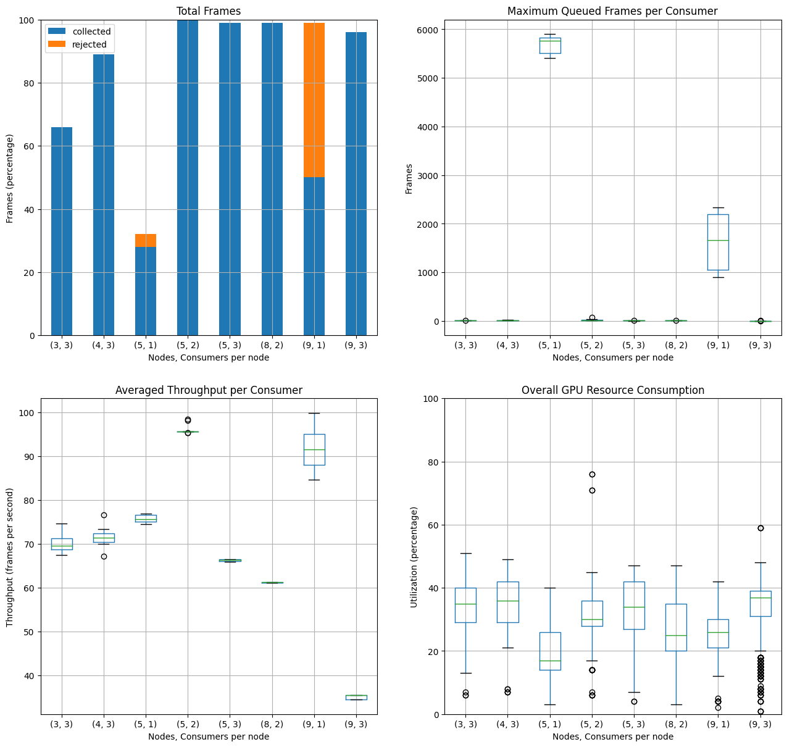

# Scalable AI@Edge computing in X-ray beamline experiments

__Can edge computing be used in X-ray beamline experiments to process a high-volume and fast data stream and help scientists make real-time decisions for their experiments?__

Edge computing offers computation close to sensors for real-time data processing. Various X-ray sensors in Argonne's Advanced Photon Source beamlines stream enormous data at a fast frame rate to the cloud for data analysis and science discovery happen in high performance computing (HPC) facility. The scientists and engineers in the beamlines have recently added the streaming and data processing feature in their software package, called [PvaPy](https://github.com/epics-base/pvaPy), to enable them to get experiment results right away as data are streamed to HPC. However, it is realized that edge computing can also provide the same real-time data processing capability by deploying computation next to the sensors and host AI@Edge applications that process data directly from the sensor. Then, we ask ourselves this question: ``can we use edge computing to process that high volume of data at the desired speed to make real-time experimental decisions?''

# Configuring Edge Comtpuing in The Beamline

> Figure 1- Dataflow of the pipeline: from X-ray detector to a visualization computer. Note that the control program in the diagram was designed for automatic scaling, but not implemented in this work.

To understand how edge computing plays in this domain, we established a workflow pipeline connecting an X-ray detector with a visualization computer placed at the end of the pipeline. We used 1U server racks equipped with a Nvidia T4 GPU accelerator as an edge computing node and configured them in the middle of the pipeline to offer AI computation. They were connected to the detector via a high-speed 10 Gbps network, however each node’s network supported up to 1 Gbps network. Each node hosted computing resources for running scientist-developed machine learning (ML) model after we quantized it to make inference faster while sacrificing a bit of accuracy. This allowed us to run more instances of the model using the same computing resource. The X-ray detector was configured to stream 0.5 Mega-pixel frames at the frame rate of 1 kHz up to 2 kHz. To understand computation and network load required in the workflow pipeline, we varied number of edge nodes and instances of the AI@Edge application. 

# Performance of The Pipeline

Interestingly, yet expectidely, we have found throughout the experiments that putting more edge computing nodes and model instances can satisfy the required frame rate by processing the streaming data and visualize them to the scientist. We needed the number of edge nodes that support the network bandwidth required by the stream at that rate. Having more instances of the ML model was able process faster frame rates. However, we also found that using excessive number of instances does not help much to process the frames, but the resource in edge nodes was underutilized while creating more network burden. Controlling of resource allocation will be the key to optimize both computing and network resources per experiment and satisfy requirements unique per experiment, towards the scientific goal, i.e. rate and resolution of frames. This pipeline with the power of edge computing can help use the beamtime more efficiently, thus reducing time and resource used in the beamline as well as reducing radiological exposure to the sample to minimize the damage.

> Figure 2- Performance of the pipeline at receiving 1 kHz data streaming. Among the cases, 5 edge nodes each running 2 instances of the ML model, 10 instances in total, performed mostly efficiently to keep up with the frame rate.

> Figure 3- Performance of the pipeline at receiving 2 kHz data streaming. Among the 3 cases, the total of 27 instances distributed in 9 edge nodes handled the data without losing any frame.

# Discussion

We believe that the capabilities of edge computing demonstrated in this experiment will be the key driver to make successful beamline experiments. Advanced X-ray sensors with higher resolution and frame rate will demand faster edge computation and better control algorithms to distribute the computation loads. As we demonstrated, the workflow can scale horizontally by allocating more edge nodes to an experiment as computation and realtimeness of data processing needs increase. This workflow will also need to use given computing resource efficiently to run ML models with different resource allocation driven by a control algorithm and to host multiple experiments on the same edge computing node when it cannot scale horizontally.

__Acknowledgement__

We thank Argonne's Advanced Photon Source for the opportunity to use the beamtime to perform the experiment. We also thank [Dr. Cherukara](https://www.anl.gov/profile/mathew-joseph-cherukara), his group members, and [Dr. Zhou](https://www.anl.gov/profile/tao-zhou) for the help and support on the beamline configuration as well as the machine learning model. Also thank Siniša Veseli for all the immediate support in the Pvapy library and fixes and improvements.